//Лабораторна робота 1

//Мета роботи

//Ознайомитися з основами мови TypeScript шляхом виконання практичних завдань, 

//що демонструють базові можливості мови: типізацію, інтерфейси, класи, композитні типи та дженерики.

//1. Типізація змінних
//Оголосіть змінні наступних типів: string, number, boolean, array, object.
//Створіть функцію, яка приймає як аргумент об'єкт із полями name (тип string) 
//та age (тип number) і повертає рядок виду: "Name: John, Age: 30".

let myString: string = "Hello";
let myNumber: number = 42;
let myBoolean: boolean = true;
let myArray: number[] = [1, 2, 3, 4, 5];
let myObject: { key: string; value: number } = { key: "id", value: 1 };

function personInfo(person: { name: string; age: number }): string {
  return `Name: ${person.name}, Age: ${person.age}`;
}

console.log(personInfo({ name: "John", age: 30 }));
// console.log(personInfo({ name: "John", age: "thirty" }));
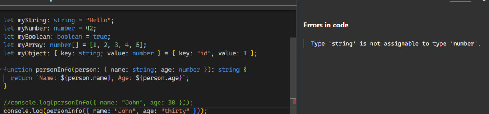
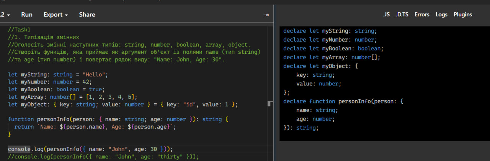
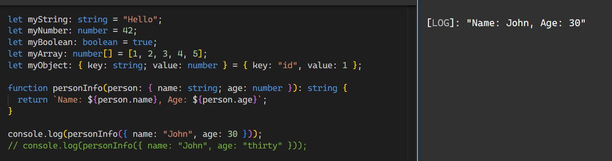

//2. Інтерфейси---------------------------------------------------------------------------------------------------------
//Оголосіть інтерфейс Person, який містить поля:
//name: string
///age: number
//address?: string (опціональне поле)
//Реалізуйте функцію printPerson, яка приймає об'єкт типу Person та виводить його дані у консоль.

interface Person {
  name: string;       
  age: number;      
  address?: string;  
}

function printPerson(person: Person): void {
  console.log(`Name: ${person.name}`);
  console.log(`Age: ${person.age}`);
  
  if (person.address) {
    console.log(`Address: ${person.address}`);
  }
}

printPerson({ name: "Vika", age: 19, address: "Odesa" });
printPerson({ name: "Bob", age: 20 });
//printPerson({ name: "Ann" });

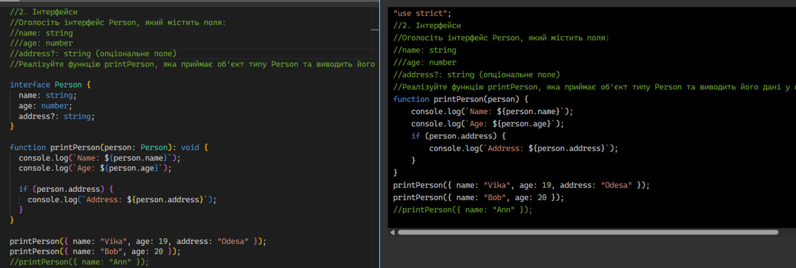
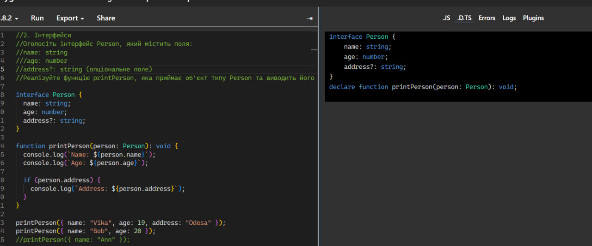
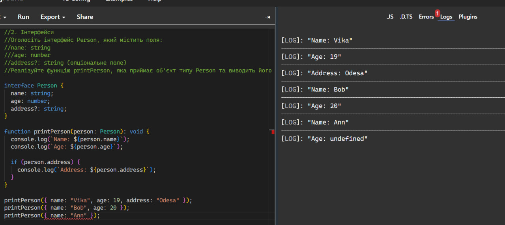
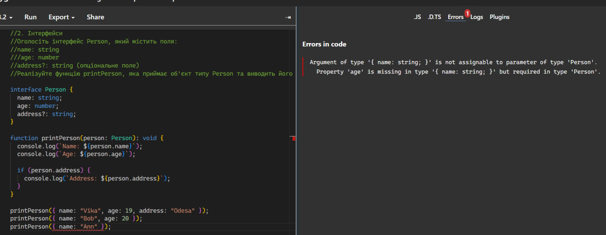
//3. Композитні типи---------------------------------------------------------------------------------------------------------
//Оголосіть об'єднаний тип (union type), наприклад: 
//Type Status = 'success' | 'error' | 'loading';
//Реалізуйте конструкцію (наприклад, функцію або умову), яка виводить повідомлення відповідно до значення Status.

type Status = 'success' | 'error' | 'loading';
function showStatus(status: Status): void {
  if (status === 'success') {
    console.log("Успіх");
  } else if (status === 'error') {
    console.log("Помилка");
  } else if (status === 'loading') {
    console.log("Завантаження");
  }
}

showStatus('success');
showStatus('loading');
// showStatus('go');

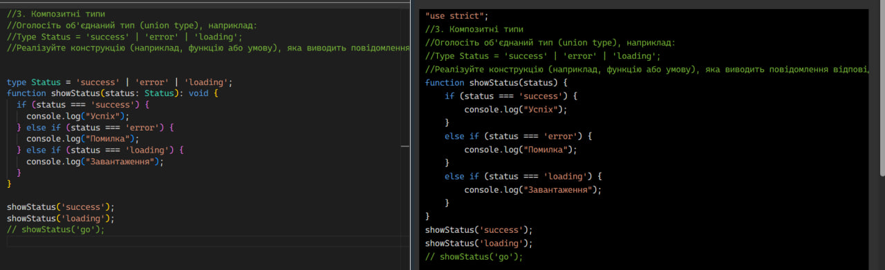
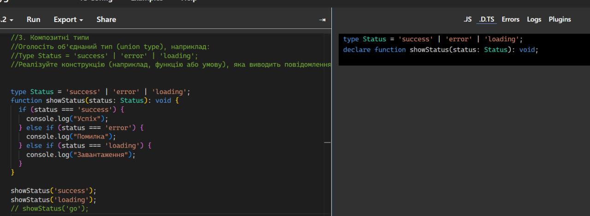
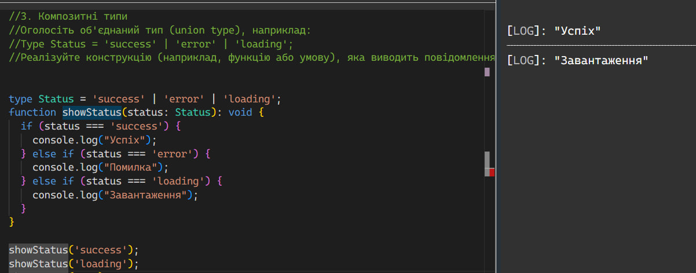
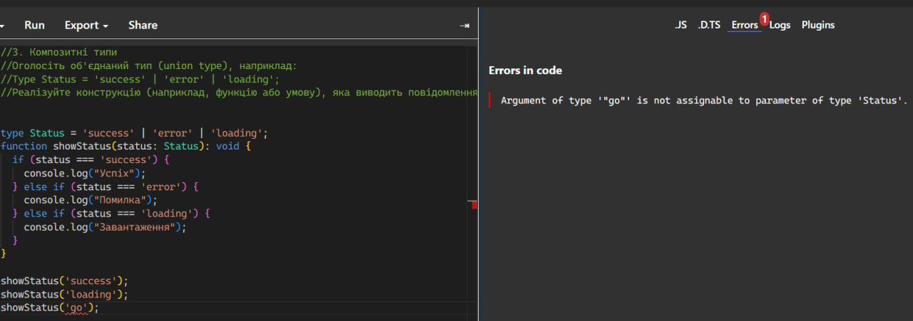

//4. Дженерики---------------------------------------------------------------------------------------------------------
//Реалізуйте функцію identity<T>(value: T): T, яка повертає передане їй значення.
//Використайте її для типів number, string та boolean.

function identity<T>(value: T): T {
  return value;
}

let numbers = identity<number>(42);
console.log(numbers); 

let strings = identity<string>("Hello");
console.log(strings); 

let booleans = identity<boolean>(true);
console.log(booleans); 

// let errors = identity<number>("Notnumber");
//console.log(errors); 

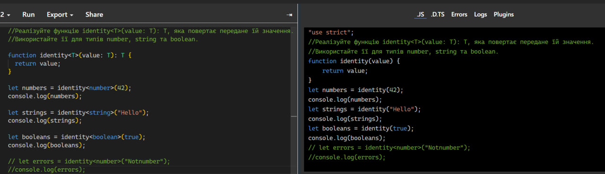
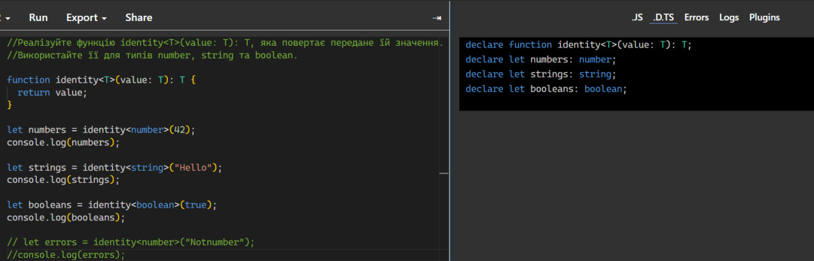
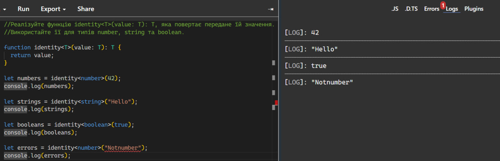
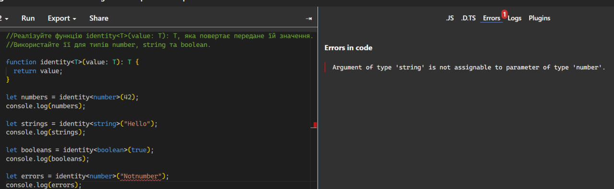

//5. Класи---------------------------------------------------------------------------------------------------------
//Реалізуйте клас Car, який містить поля:
//model: string
//year: number
//Додайте метод getCarInfo(), який повертає рядок виду: "Model: Toyota, Year: 2020"

class Car {
  model: string;
  year: number;

  constructor(model: string, year: number) {
    this.model = model;
    this.year = year;
  }

  getCarInfo(): string {
    return `Model: ${this.model}, Year: ${this.year}`;
  }
}

const myCar = new Car("Toyota", 2020);
console.log(myCar.getCarInfo()); 
const myCar2 = new Car("Toyota", "2020");
console.log(myCar.getCarInfo()); 

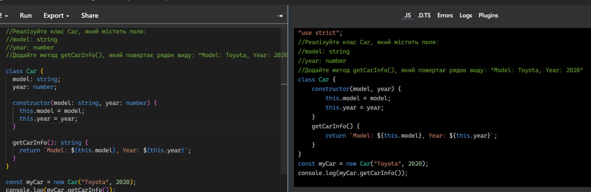
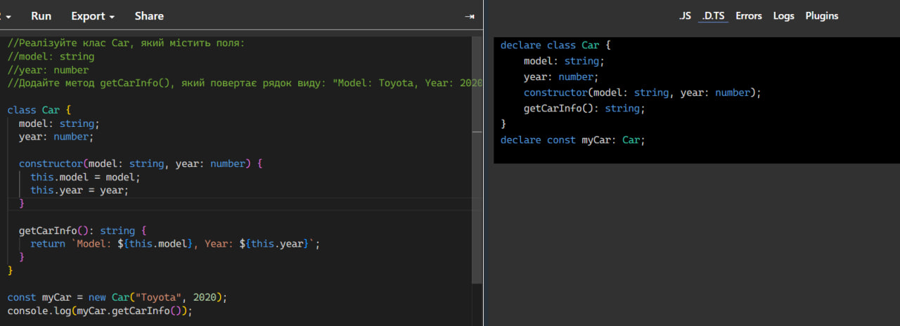
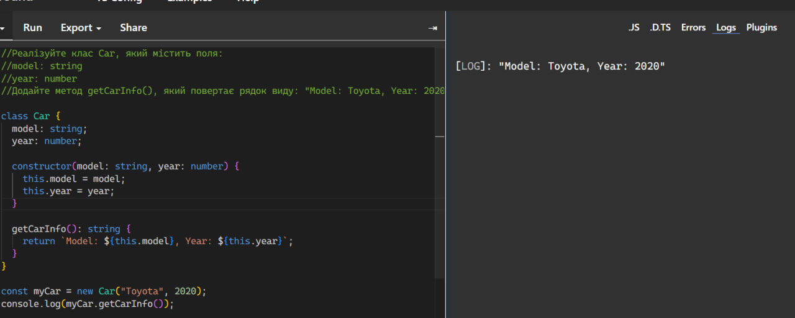
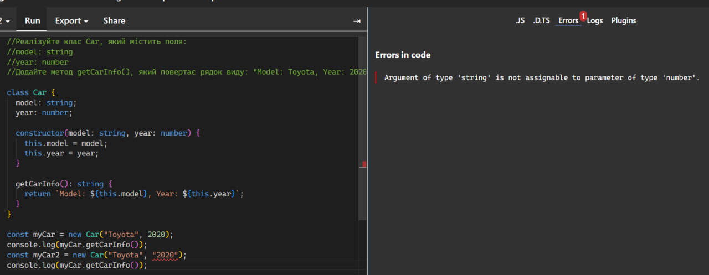
